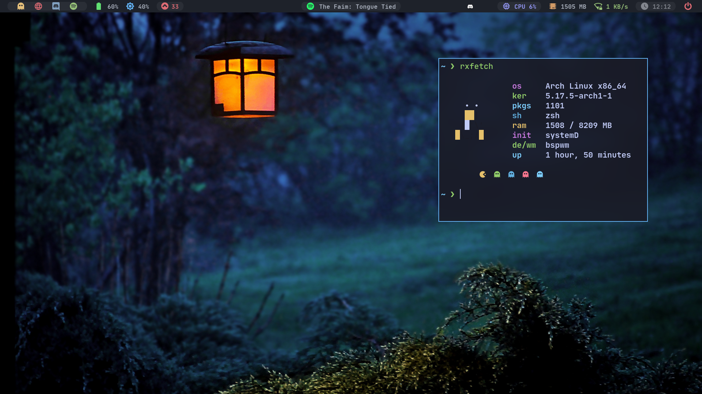
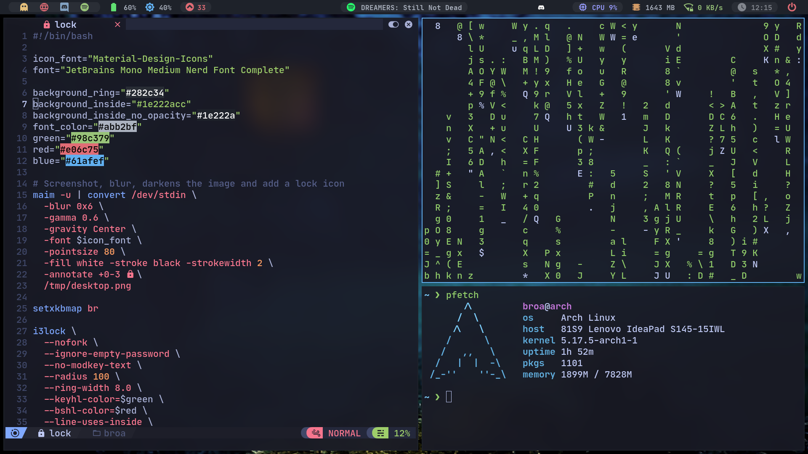
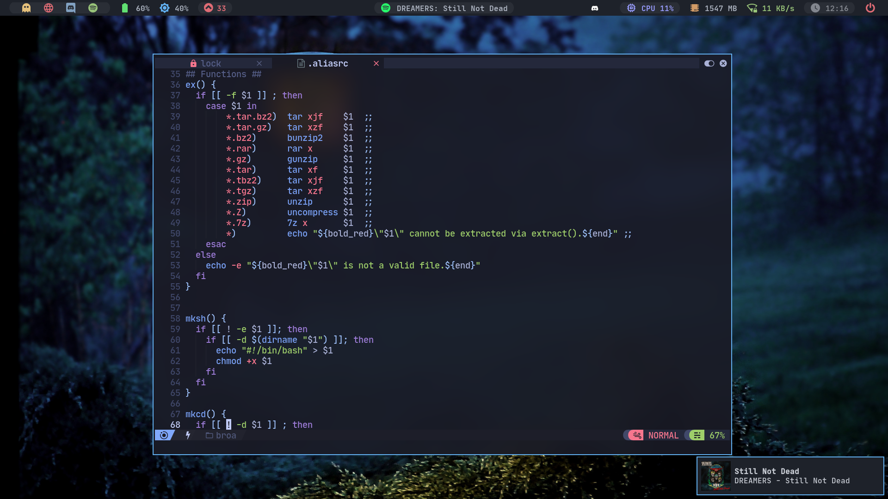

<h1 align="center">dotfiles</h1>

<p align="center">
  
  
  
</p>

# Installation
```c
git clone https://github.com/MatheusTT/dotfiles.git && cd dotfiles
./install.sh 
```
## Important !!!
Remove the "updates" module in polybar, and comment some lines in "~/dotfiles/.config/polybar/launch.sh" if your not using arch.


# Custom KeyBinds
| Key | Action |
| ----- | ----- |
| super + Return | kitty |
| super + \ | rofi |
| super + b | chrome |
| super + f | nautilus |
| Print,shift + Print | selection print, full desktop screenshot |
| super + shift + o | lock screen |
| super + shift + q | close focused window |
| super + k | kill focused window |
| super + shift + x | runs xkill |
| alt + Tab | change to the next workspace active |
| shift + (VolumeKeys) | raise/lower spotify volume |


# Programs Used
  - AppLauncher: rofi
  - Bar: polybar
  - Compositor: [picom-jonaburg](https://github.com/jonaburg/picom)
  - Font: JetBrains Mono, Material
  - LockScreen: [i3lock-color](https://github.com/Raymo111/i3lock-color)
  - Notification: dunst
  - Terminal: kitty
  - Shell: ZSH with Oh My Zsh
  - WindowManager: bspwm
  - ScreenShot: flameshot, maim
  - TextEditor: [NvChad](https://github.com/NvChad/nvchad)
  - GTK Theme: [TokyoNight](https://github.com/stronk-dev/Tokyo-Night-Linux)
  - Icon Theme: Papirus
  - Cursor Theme: Breeze

# Wallpapers
  - [Wallpaper used in this rice](https://www.pexels.com/photo/selective-focus-photography-of-turned-on-black-metal-framed-light-sconce-414144/)
  - [My Collection of Wallpapers](https://github.com/MatheusTT/wallpapers)

# Credits
  - [siduck](https://github.com/siduck/dotfiles), for his polybar config
  - [Manas140](https://github.com/Manas140/dotfiles), for [~/scripts/cl](https://github.com/Manas140/sh/blob/main/src/cl) and [~/scripts/lock](https://github.com/Manas140/dotfiles/blob/main/bin/lock)